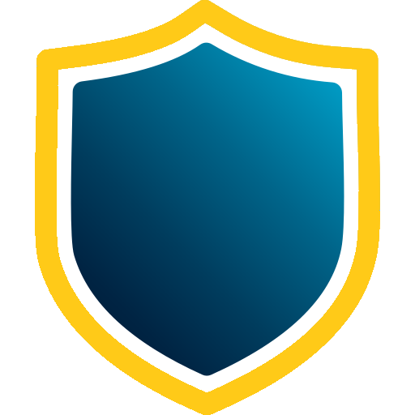

<div align="center">
  <p>
    <a href="#"></a>
  </p>
</div>


# NoDPI
*Say NO to blocking!*

[]()

This project is a fork of the repository https://github.com/theo0x0/nodpi and is developed independently. Do not confuse with https://github.com/raspabamos/nodpi !

## Description / Описание
NoDPI is a utility for bypassing the DPI (Deep Packet Inspection) system, which allows blocking access to Internet resources. This utility allows you to bypass such blockings and freely use the Internet.

In particular, it allows you to eliminate YouTube blocking in Russia. Unfortunately, I cannot guarantee the absolute functionality of the program in all conditions and with all providers, but nevertheless, in most cases, it copes with its task perfectly.

The utility works on the principle of HTTP proxy. It analyzes packet headers and fragments them, which allows you to deceive DPI. The utility does not collect or send any data and does not require administrator privileges to run.

<hr>

NoDPI - это утилита для обхода системы DPI (Deep Packet Inspection), которая позволяет блокировать доступ к интерент-ресурсам. Данная утилита позволяет обходить такие блокировки и свободно пользоваться Интернетом. 

В частности, она позволяет устранить блокировку YouTube в России. К сожалению, я не могу гарантировать абсолютную работоспособность программы во всех условиях и у всех провайдеров, но тем не менне в большинстве случаев она отлично справляется со своей задачей.

Утилита работает по принципу HTTP прокси. Она анализирует заголовки пакетов и фрагментирует их, что позволяет обмануть DPI. Утилита не собирает и не отправляет никаких данных и не требует привелегий администратора для запуска.

### Alternatives / Альтернативы 
- **[GoodbyeDPI](https://github.com/ValdikSS/GoodbyeDPI)** by @ValdikSS (for Windows)
- **[zapret](https://github.com/bol-van/zapret)** by @bol-van (for MacOS, Linux and Windows)
- **[Green Tunnel](https://github.com/SadeghHayeri/GreenTunnel)** by @SadeghHayeri (for MacOS, Linux and Windows)
- **[DPI Tunnel CLI](https://github.com/nomoresat/DPITunnel-cli)** by @zhenyolka (for Linux and routers)
- **[DPI Tunnel for Android](https://github.com/nomoresat/DPITunnel-android)** by @zhenyolka (for Android)
- **[PowerTunnel](https://github.com/krlvm/PowerTunnel)** by @krlvm (for Windows, MacOS and Linux)
- **[PowerTunnel for Android](https://github.com/krlvm/PowerTunnel-Android)** by @krlvm (for Android)
- **[SpoofDPI](https://github.com/xvzc/SpoofDPI)** by @xvzc (for macOS and Linux)
- **[SpoofDPI-Platform](https://github.com/r3pr3ss10n/SpoofDPI-Platform)** by @r3pr3ss10n (for Android, macOS, Windows)
- **[GhosTCP](https://github.com/macronut/ghostcp)** by @macronut (for Windows)
- **[ByeDPI](https://github.com/hufrea/byedpi)** for Linux/Windows + **[ByeDPIAndroid](https://github.com/dovecoteescapee/ByeDPIAndroid/)** for Android (no root)
- **[youtubeUnblock](https://github.com/Waujito/youtubeUnblock/)** by @Waujito (for OpenWRT/Entware routers and Linux)

## Terms of Use and Disclaimer / Условия использования и отказ от ответственности
This provision is in addition to the license and takes precedence over it.

The developer and/or supplier of this software shall not be liable for any loss or damage, including but not limited to direct, indirect, incidental, punitive or consequential damages arising out of the use of or inability to use this software, even if the developer or supplier has been advised of the possibility of such damages.

The developer and/or supplier of this software shall not be liable for any legal consequences arising out of the use of this software. This includes, but is not limited to, violation of laws, rules or regulations, as well as any claims or suits arising out of the use of this software. The user is solely responsible for compliance with all applicable laws and regulations when using this software.

The developer and/or supplier of this software shall not be liable for any loss or damage arising out of the unauthorized use of this software. Unauthorized use includes, but is not limited to, using the software for illegal purposes, infringing copyrights, patents, trademarks or other intellectual property rights, or using the software in violation of the license terms of the software.

This software may not be used for illegal or unlawful purposes. Any use of the software for illegal activities, including but not limited to fraud, hacking, privacy violation, distribution of malware or any other actions contrary to the code and regulations is strictly prohibited. The user is fully responsible for any legal consequences arising from the use of this software for illegal purposes.

Your use of this software constitutes your agreement to the terms of this disclaimer. If you do not agree to these terms, you must stop using this software immediately.

<hr>

Данное положение является дополнением к лицензии и является приоритетным по отношению к ней.

Разработчик и/или поставщик данного программного обеспечения не несет никакой ответственности за любые убытки или ущерб, включая, но не ограничиваясь, прямые, косвенные, случайные, штрафные или косвенные убытки, возникшие в результате использования или невозможности использования данного программного обеспечения, даже если разработчик или поставщик были уведомлены о возможности таких убытков.

Разработчик и/или поставщик данного программного обеспечения не несут ответственности за любые юридические последствия, возникшие в результате использования данного программного обеспечения. Это включает, но не ограничивается, нарушение законодательства, правил или нормативных актов, а также любые претензии или иски, возникшие в результате использования данного программного обеспечения. Пользователь несет полную ответственность за соблюдение всех применимых законов и нормативных актов при использовании данного программного обеспечения.

Разработчик и/или поставщик данного программного обеспечения не несут ответственности за любые убытки или ущерб, возникшие в результате неправомерного использования данного программного обеспечения. Неправомерное использование включает, но не ограничивается, использование программного обеспечения для незаконных целей, нарушение авторских прав, патентных прав, торговых марок или других прав интеллектуальной собственности, а также использование программного обеспечения в нарушение условий лицензии данного программного обеспечения.

Данное программное обеспечение не может использоваться в противоправных целях или целях, нарушающих законодательство. Любое использование программного обеспечения для незаконных действий, включая, но не ограничиваясь, мошенничество, взлом, нарушение конфиденциальности, распространение вредоносного ПО или любые другие действия, противоречащие закодательству и нормативным актам, строго запрещено. Пользователь несет полную ответственность за любые юридические последствия, возникшие в результате использования данного программного обеспечения в противоправных целях.

Использование данного программного обеспечения означает ваше согласие с условиями данного отказа от ответственности. Если вы не согласны с этими условиями, вы должны немедленно прекратить использование данного программного обеспечения.

## Quick start / Быстрый старт
1) Download the latest version for your OS from [the Releases page](https://github.com/GVCoder09/NoDPI/releases) and unzip it
2) Go to the directory with the unzipped utility and run it with the command `nodpi.exe --blacklist blacklist.txt` in Windows or `./nodpi --blacklist ./blacklist.txt` in Linux. You can replace the file `blacklist.txt` with your own file. **If the blacklist file is not specified, the program will search for the file `blacklist.txt` in the current directory by default.**
3) In the browser or system settings, set the proxy to 127.0.0.1:8881
4) In some browsers, you may need to disable kyber
5) Enjoy!

While the utility is running, you may see a `NON-CRITICAL ERROR`. As a rule, these errors are not fatal and there is nothing terrible about them. But if you are downloading a file or you need a 100% stable connection, you should disable this utility.

Please report any problems and malfunctions to us on [the Issues page](https://github.com/GVCoder09/NoDPI/issues)

<hr>

1) [Скачайте](https://github.com/GVCoder09/NoDPI/releases) последнюю версию утилиты для вашей ОС и разархивруйте ее
2) Перейдите в каталог с распакованной утилитой и запустите ее командой `nodpi.exe --blacklist blacklist.txt` в Windows или `./nodpi --blacklist ./blacklist.txt` в Linux. Вы можете заменить файл `blacklist.txt` своим файлом. **Если файл черного списка не указан, то программа по умолчанию будет искать файл `blacklist.txt` в текущей директории.**
3) В настройках браузера или системы настройте прокси на 127.0.0.1:8881
4) В некоторых браузерах может потребоваться отключение kyber
5) Наслаждайтесь!

Во время работы утилиты могут возникать ошибки с пометкой `NON-CRITICAL ERROR`. Как правило, эти ошибки не фатальные и ничего страшного в них нет. Но если вы скачиваете файл или вам нужно 100% стабильное соединение, вам стоит отключить эту утилиту.

О всех проблемах и неполадках, пожалуйста, сообщайте нам в [Issues](https://github.com/GVCoder09/NoDPI/issues)

## Supported arguments / Поддерживаемые аргументы командной строки
```
usage: nodpi.exe [-h] [--host HOST] [--port PORT] [--blacklist BLACKLIST] [--log LOG]

options:
  -h, --help            show this help message and exit
  --host HOST           The host to run the proxy on
  --port PORT           The port to run the proxy on
  --blacklist BLACKLIST
                        The path to the blacklist file
  --log LOG             The path to the log file

```
## Run from source code / Запуск из исходного кода

1) Make sure you have Python 3.8 or higher installed. No third-party libraries are required
2) Clone the repository `git clone https://github.com/GVCoder09/NoDPI.git` or [download the archive](https://github.com/GVCoder09/NoDPI/archive/refs/heads/main.zip) with the source code and unzip it
3) Go to the main directory and run the code with the command `python src/main.py --blacklist ./blacklist.txt`
3) In the browser or system settings, set the proxy to 127.0.0.1:8881
4) In some browsers, you may need to disable kyber
5) Enjoy!

By default, all errors are saved to a file `errors.log`. You can change the path to the file via the parameter `--log`

<hr>

1) Убедитесь что у вас установлен Python версии 3.8 и выше. Никакие сторонние библиотеки не требуются
2) Клонируйте репозиторий `git clone https://github.com/GVCoder09/NoDPI.git` или [скачайте архив](https://github.com/GVCoder09/NoDPI/archive/refs/heads/main.zip) с исходным кодом и распакуйте его
3) Перейдите в основную директорию и запустите код командой `python src/main.py --blacklist ./blacklist.txt`
3) В настройках браузера или системы настройте прокси на 127.0.0.1:8881
4) В некоторых браузерах может потребоваться отключение kyber
5) Наслаждайтесь!

По умолчанию все ошибки сохраняются в файл `errors.log`. Вы можете изменить путь к файлу через параметр `--log`

## Known bugs / Известные проблемы

- Doesn't work at all. Yes, that can happen :(
- Doesn't bypass IP block
- Only TCP
- Not working with sites with old TLS

During operation, non-fatal errors may occur, about which the program notifies. As a rule, they do not affect the operation. All errors are saved in a file `errors.log` and you can report them to us.

<hr>

- Не работает вообще. Да, такое может быть :(
- Не работает, если сайт заблокирован по IP
- Только для TCP
- Не работает для сайтов со старым TLS

Во время работы могут возникать нефатальные ошибки, о чем программа уведомляет. Как правило, они не влияют на работу. Все ошибки сохраняются в файле `errors.log` и вы можете сообщать нам о них.
